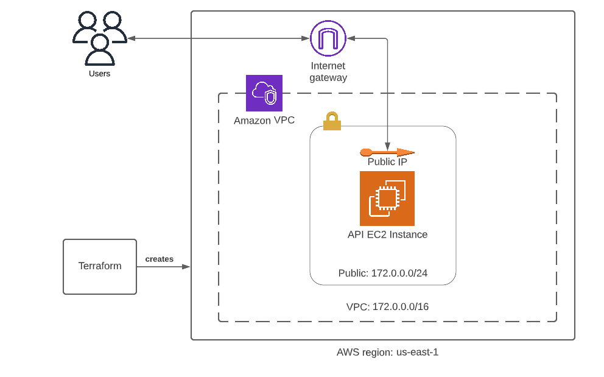

# AWS Infrastructure Managed by Terrafrom 

## Getting Started

It would be good to get the environment with Docker up and running. 

Run `make environment`

By default, the test environment configuration is loaded to the docker container. You can customize this as you see fit with in the `docker-compose.yml` file.

### Note: 
In order for Terraform to provision resources, you will need to supply a `.aws` folder similar to the `.aws.example` folder that is as `.infra/meta` with the required values.

Run `make check` to format and validate the Terraform config files. 

After validating all files are error free, run `make plan` to get a Terraform plan of what resources will be created.

Finally, run `make infra` to get all resources created and running. 

 

### Architecture Diagram

